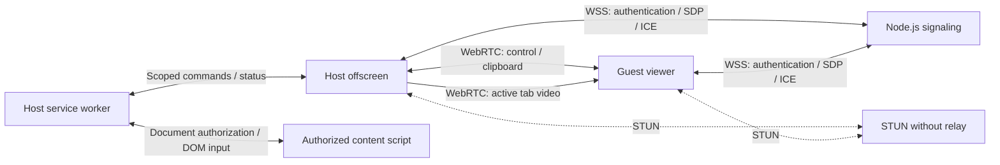

# Architecture

## Extension contexts

The service worker owns session authorization, the selected host window, scoped `chrome.tabs` operations, and DOM input routing. The host offscreen document retains authorized `tabCapture` streams, WebSocket signaling, WebRTC connections, and the clipboard adapter. The guest's full-page viewer owns its peer connection and plays received video directly in a `<video>` element. The popup provides host consent and controls and opens or focuses the guest page.

Internal extension ports carry JSON messages, not `MediaStream` objects. Shared peer transport runs in host offscreen or guest viewer context. Closing or reloading the guest page ends its session. It returns to a connection form when opened again and does not reconnect automatically.

## Identity and pairing

Registration HTTP requests, CORS preflights and WebSocket upgrades accept any exact `chrome-extension://` origin with a valid 32-character Chrome/Edge ID. No installation-ID list is configured; legacy `ALLOWED_ORIGINS` is ignored. Ordinary web origins, missing origins and malformed IDs are rejected. Exact loopback HTTP origins can be enabled explicitly for development. CORS reflects the accepted origin with `Vary: Origin`. This filter is separate from device authentication; internal extension sender-ID checks still isolate extension messages.

`POST /v1/devices` creates a random 128-bit public identifier and returns a 256-bit owner credential once. SQLite (local development) or PostgreSQL (DATABASE_URL) stores the SHA-256 hash of that credential. Both implement the asynchronous DeviceStore contract. Registration checks capacity and inserts atomically; PostgreSQL uses a single-client transaction with a table lock. A four-connection pool has five-second connection and query limits; TLS verifies the server certificate by default. Storage is initialized before the server listens. The extension stores it in `storage.local`, restricted to `TRUSTED_CONTEXTS`; this does not encrypt the browser profile against someone with disk access.

`/v1/connect` accepts WSS messages defined by `packages/protocol`: `host.open`, `guest.join`, `signal`, `host.close`, and `ping`. The server emits `host.ready`, `paired`, `signal`, `ended`, `error`, and `pong`. Passwords contain 8–256 characters and are checked using asynchronous scrypt with a random salt and bounded concurrency. They are not saved in either database. Authentication capacity is reserved before identity lookup, and attempt tokens reject completions after timeout, disconnect or shutdown. Knowing a public identifier does not grant the host role.

GET /health reports process liveness; GET /ready reports initialized storage availability with coalesced probes cached for one second. Shutdown stops admission, drains tracked handlers, and closes storage. Storage failures return generic errors without exposing connection strings.

Rooms belong to the authenticated socket. Each opening receives a new session ID; signaling is checked against the session and socket role. Room validity is checked again after asynchronous cryptographic work. A second guest cannot displace the first. Protocol incompatibility is reported explicitly; both participants must update together when the peer protocol changes. Existing installation identities do not need to be recreated.

The signaling operator is trusted for pairing. TLS protects production signaling and passwords in transit; WebRTC encrypts direct transport. There is no PAKE or independent peer identity guarantee against malicious signaling.

## Capture, transport, and input

The manifest uses `tabCapture`, `activeTab`, `scripting`, and `webNavigation`, with optional HTTP/HTTPS host access requested during sharing. There is no extension `debugger` permission or runtime CDP capture. Capturing a tab requires the host to invoke the extension on that tab. Its short-lived stream identifier is obtained and consumed in offscreen with the `USER_MEDIA` reason before waiting for a guest. Capture is video-only.

A session can retain up to five authorized tab streams. Only the active authorized tab is transmitted. A new tab, including one created remotely, waits for local host approval. Releasing a tab stops its capture. Native capture cancellation ends the session and requires fresh local authorization. Tab administration remains limited to the consented window.

A stable peer connection contains reliable control and clipboard data channels. A separate video peer connection is created for each presentation generation and negotiated over the authenticated control channel. It carries the selected tab's video track. Switching tabs or documents, changing zoom, or resizing invalidates the previous presentation. The viewer clears old video and disables input until the current document and geometry are ready and the first frame from the new generation is available. Late messages from prior generations cannot re-enable input.

Every input command is checked against session, authorized window and tab, active document, current presentation generation, permissions, pause state, and control state. Each accessible frame in the authorized active tab has its own isolated controller. The background matches browser-provided frame/document identities and parent relationships to the parent's iframe `contentWindow` through numeric `window.frames` indices. Indices and URLs never authorize a document. Routing uses only extension messaging, without a page `postMessage` bridge. Visual overlays add presentation nodes, which are never used as routing identities.

Pointer routing descends through current hit targets, converting each iframe content box to its child's CSS viewport. Keyboard and text routing follow the real focused frame chain in Live control and an independent virtual focus chain in Visual only. A prepare/verify/commit exchange checks connected targets, frame indices and geometry before dispatch. Commands execute in order and held input belongs to its original document. Navigation retires affected controllers and cancels pending routes; pause, control withdrawal and termination release held input in all controllers. Child loading or denied injection does not reset the top-level video presentation. Browser navigation, history, and tab management still use `chrome.tabs`.

Peer protocol 4 retains `input.release`, scoped to the existing tab/capture/document/generation identity. A current release invalidates queued input and in-flight preparation; old releases are no-ops. The receiving transport handles authenticated current releases immediately, while later commands wait for cancellation to finish. Cleanup from a failed route checks its original presentation and revision before releasing anything. The guest discards pending movement and cancels held input on Escape, blur, hidden visibility and lost/canceled pointer capture. Live control emits `pointercancel`, not a completion click; visual cancellation only releases extension-owned gesture state. Both peers must update; installation identities and signaling APIs are unchanged.

In Live control, pointer gestures keep their down target independently of event cancellation. Mouseup targets the current hit element; click targets the connected common ancestor of down/up targets. Canceling pointerdown suppresses compatibility mouse events, while canceling mousedown suppresses focus without suppressing click. Form activation uses browser click defaults and rollback, effective disabled state, Space activation, radio/single-select arrow navigation, and the eligible default submitter for implicit Enter. It preserves HTML validation and canceled click/keyboard behavior. Native select popups and multiple-selection keyboard behavior remain unsupported.

The viewer coalesces only pointer moves once per animation frame and flushes the latest point before discrete actions. Cancellation discards it. Discrete commands are never silently dropped: the 250-command/second and 256-pending-message limits end the session and invoke cleanup on overflow. Channel send exceptions, rejected command enqueues and failed delivery to the current host controller also end the session; counters reset on cleanup. A delivery failure from an obsolete generation cannot end current control. Unit tests cover delayed transport and generation races, while browser tests compare form behavior with real browser input on local fixtures.

Live control synthetic DOM events are not trusted browser input. Canvas and SVG receive coordinate-bearing clicks, pointer events and cancellable wheel events. Basic inputs, textareas, contenteditable elements and scroll containers retain DOM editing support. Pages requiring `Event.isTrusted`, native pointer capture, cross-frame native dragging, inaccessible frames, native dialogs and advanced editing behavior remain outside the compatibility guarantee. Frame conversion supports borders, padding, scrolling and positive axis-aligned scaling; rotation, skew and perspective report a limitation. Coordinates use the current CSS viewport, including browser zoom, rather than assuming video pixels equal CSS pixels.

Shared state reports capture and control availability. Notifications have occurrence IDs: dismissing an occurrence acknowledges that ID, so repeated state updates cannot restore it and a later error with identical text can still be shown. Operations such as creating a tab have request IDs and completion results; the guest dialog remains open on failure.

## Visual simulation

Rendering helpers stay inside the serialized `installDomControl` function. Text draws read computed typography, per-side borders, corner radii and padding, scaled to visible bounds. Transparent text surfaces composite solid ancestor backgrounds. Choices and button states use passive, allowlisted replicas inside nested closed shadow roots. Readable CSS is sanitized and shared through constructed stylesheets; its cascade, conditions, variables, selection rules and pseudoelements determine the appearance. Context shells preserve selector ancestry; radio peers preserve virtual group state while only the affected option is displayed. Original elements, values, attributes and focus remain unchanged. Ancestor layout is removed from replicas, and each surface is scaled and clipped to the real option. Page styles take priority over GhostPair's accent.

Replica CSS is checked at most twice per second per document or open shadow root. Replicas are reused until their markup, virtual state, theme, stylesheet or dimensions change. Construction is bounded to 512 elements, 32 ancestors and 4,000 CSS rules/1 MiB per scope. Scripts, handlers, custom-element construction, embedded content and URL-bearing declarations are excluded; inaccessible stylesheets are not fetched. A visible page-colored indicator or outline is used when selection cannot be reproduced, including JavaScript-managed classes and unsupported markup. ARIA radios clear peers only within their nearest explicit radiogroup. Existing preview disposal also removes replicas and stylesheet caches.

The host is authoritative for `controlMode` (`visual` or `live`) and `controlRevision`. Sessions start in visual mode; both fields travel in snapshots. All commands carry the revision stamped before buffering. Mode changes and manual clearing block admission, cancel pending preparation/gestures, configure authorized controllers and publish the new revision. Late old commands and releases cannot run in a newer mode. This revision is separate from presentation generations, so mode changes do not restart video. Protocol 4 rejects older peers explicitly.

The self-contained isolated controller branches before any pointer, key or text dispatch. Visual execution reads page geometry and initial values but edits only its own memory and a closed Shadow DOM overlay. The layer is transparent to pointer input except for extension-owned native text editors. Remote simulation never focuses original elements, changes their values, submits forms or dispatches page interaction events. Local host gestures focus these native editors; page-level listeners may observe retargeted overlay events. The renderer maintains virtual text selection and masks passwords. Host and guest edits update one preview model with revisioned values. Native selection and IME remain stable while rendering. Clipboard events copy plain text through user gestures without continuous clipboard permissions. Remote commands wait at most five seconds behind active composition. Drag transfers use single-use tokens and authorized document IDs: the destination acknowledges insertion before source deletion, and stale source revisions preserve the source. Targets without previews receive one before a drop can reach the original control. Supported controls receive visual states; other targets get a halo when click animations are enabled. Wheel scrolling and explicit extension navigation/tab commands retain their real behavior.

FrameControl records virtual iframe ancestors after a simulated pointer-down; subsequent text follows that chain through the same document-identity checks as real control. A root-only notice is sent after successful simulation, avoiding clipping inside child frames. Each notice lasts 1500 ms with a 3000 ms minimum interval. The existing error/notice channel remains independent.

`visualPreferences` is a separate local-storage entry validated with defaults of notices off, click animations on, independent persistent text/other durations, temporary values of 10/3 seconds and purple (`#7871e8`). Temporary duration accepts 0.1–30 seconds in tenths. The `accentColor` field accepts an opaque six-digit hex color; legacy duration/seconds migrate into both categories without losing color or notices. Preferences can be saved before hosting and during a host session. A CSS variable on the presentation layer updates existing previews without resetting virtual state. The boolean `clickAnimations` migrates to true for older settings. Turning it off removes active halos without changing previews, notices, revision or inactivity timestamps. Preferences remain host-local and do not change peer protocol 4. One host-side inactivity timer per category clears that category across authorized frames. Authenticated local editing/selection refreshes text activity. Active composition, pointer selection and drag/drop protect text previews from expiration. Expiration of other previews does not cancel text editing. No simulated text is stored. Escape releases gestures without clearing previews; navigation, switching tabs/modes, pause, control withdrawal and shutdown dispose them. Geometry-only rebinding preserves previews in the same document. Drawing follows current rectangles, clips against scroll containers and drops disconnected elements.

## Clipboard and lifecycle

Clipboard permissions are optional. Synchronization runs only when both peers enable it, begins from a baseline value that is not transmitted, and deduplicates writes by version and origin. It sends text over the direct clipboard channel, keeps no history, and never sends clipboard content through signaling. The size limit is 256 KiB of UTF-8.

Ending the session, canceling native capture, losing a required permission, or terminating the viewer stops media, pending input, clipboard polling, and peer channels. Pause and withdrawal of control disable the relevant actions. The action icon has no activity badge and keeps the static GhostPair title. Session state appears in the extension interface. Native capture indicators remain enabled; the extension does not suppress browser controls.

## Trust boundaries

- Live control lets an authorized guest change or submit data in authorized pages. Visual only restricts page clicks and typing to previews; extension navigation, tab management and scrolling remain real.
- Web pages cannot invoke internal extension messages; the manifest does not declare `externally_connectable`.
- The owner credential is never sent to the guest or included in addresses or logs.
- TURN servers and relay candidates are rejected. Some restrictive networks cannot establish a direct session.
- Only public `VITE_*` build settings enter the extension bundle. The root `.env` also configures the server, with process variables taking precedence. Server-only settings must not use the `VITE_` prefix.
