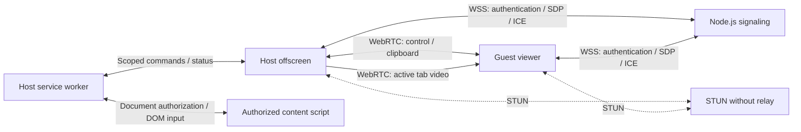

# Architecture

## Extension contexts

The service worker owns session authorization, the selected host window, scoped `chrome.tabs` operations, and DOM input routing. The host offscreen document retains authorized `tabCapture` streams, WebSocket signaling, WebRTC connections, and the clipboard adapter. The guest's full-page viewer owns its peer connection and plays received video directly in a `<video>` element. The popup provides host consent and controls and opens or focuses the guest page.

Internal extension ports carry JSON messages, not `MediaStream` objects. Shared peer transport runs in host offscreen or guest viewer context. Closing or reloading the guest page ends its session. It returns to a connection form when opened again and does not reconnect automatically.

## Identity and pairing

`POST /v1/devices` creates a random 128-bit public identifier and returns a 256-bit owner credential once. SQLite stores the SHA-256 hash of that credential. The extension stores it in `storage.local`, restricted to `TRUSTED_CONTEXTS`; this does not encrypt the browser profile against someone with disk access.

`/v1/connect` accepts WSS messages defined by `packages/protocol`: `host.open`, `guest.join`, `signal`, `host.close`, and `ping`. The server emits `host.ready`, `paired`, `signal`, `ended`, `error`, and `pong`. Passwords contain 8–256 characters and are checked using asynchronous scrypt with a random salt and bounded concurrency. They are not saved in SQLite. Knowing a public identifier does not grant the host role.

Rooms belong to the authenticated socket. Each opening receives a new session ID; signaling is checked against the session and socket role. Room validity is checked again after asynchronous cryptographic work. A second guest cannot displace the first. Protocol incompatibility is reported explicitly; both participants must update together when the peer protocol changes. Existing installation identities do not need to be recreated.

The signaling operator is trusted for pairing. TLS protects production signaling and passwords in transit; WebRTC encrypts direct transport. There is no PAKE or independent peer identity guarantee against malicious signaling.

## Capture, transport, and input

The manifest uses `tabCapture`, `activeTab`, `scripting`, and `webNavigation`, with optional HTTP/HTTPS host access requested during sharing. There is no extension `debugger` permission or runtime CDP capture. Capturing a tab requires the host to invoke the extension on that tab. Its short-lived stream identifier is obtained and consumed in offscreen with the `USER_MEDIA` reason before waiting for a guest. Capture is video-only.

A session can retain up to five authorized tab streams. Only the active authorized tab is transmitted. A new tab, including one created remotely, waits for local host approval. Releasing a tab stops its capture. Native capture cancellation ends the session and requires fresh local authorization. Tab administration remains limited to the consented window.

A stable peer connection contains reliable control and clipboard data channels. A separate video peer connection is created for each presentation generation and negotiated over the authenticated control channel. It carries the selected tab's video track. Switching tabs or documents, changing zoom, or resizing invalidates the previous presentation. The viewer clears old video and disables input until the current document and geometry are ready and the first frame from the new generation is available. Late messages from prior generations cannot re-enable input.

Every input command is checked against session, authorized window and tab, active document, current presentation generation, permissions, pause state, and control state. Each accessible frame in the authorized active tab has its own isolated controller. The background matches browser-provided frame/document identities and parent relationships to the parent's iframe `contentWindow` through numeric `window.frames` indices. Indices and URLs never authorize a document. Routing uses only extension messaging, without a page `postMessage` bridge or visible DOM markers.

Pointer routing descends through current hit targets, converting each iframe content box to its child's CSS viewport. Keyboard and text routing follow the real focused frame chain. A prepare/verify/commit exchange checks connected targets, frame indices and geometry before dispatch. Commands execute in order and held input belongs to its original document. Navigation retires affected controllers and cancels pending routes; pause, control withdrawal and termination release held input in all controllers. Child loading or denied injection does not reset the top-level video presentation. Browser navigation, history, and tab management still use `chrome.tabs`; the public peer protocol and saved identities are unchanged.

Synthetic DOM events are not trusted browser input. Canvas and SVG receive coordinate-bearing clicks, pointer events and cancellable wheel events. Basic inputs, textareas, contenteditable elements and scroll containers retain DOM editing support. Pages requiring `Event.isTrusted`, native pointer capture, cross-frame native dragging, inaccessible frames, native dialogs and advanced editing behavior remain outside the compatibility guarantee. Frame conversion supports borders, padding, scrolling and positive axis-aligned scaling; rotation, skew and perspective report a limitation. Coordinates use the current CSS viewport, including browser zoom, rather than assuming video pixels equal CSS pixels.

Shared state reports capture and control availability. Notifications have occurrence IDs: dismissing an occurrence acknowledges that ID, so repeated state updates cannot restore it and a later error with identical text can still be shown. Operations such as creating a tab have request IDs and completion results; the guest dialog remains open on failure.

## Clipboard and lifecycle

Clipboard permissions are optional. Synchronization runs only when both peers enable it, begins from a baseline value that is not transmitted, and deduplicates writes by version and origin. It sends text over the direct clipboard channel, keeps no history, and never sends clipboard content through signaling. The size limit is 256 KiB of UTF-8.

Ending the session, canceling native capture, losing a required permission, or terminating the viewer stops media, pending input, clipboard polling, and peer channels. Pause and withdrawal of control disable the relevant actions. The action icon has no activity badge and keeps the static GhostPair title. Session state appears in the extension interface. Native capture indicators remain enabled; the extension does not suppress browser controls.

## Trust boundaries

- An authorized guest can change or submit data in authorized pages within the scope accepted by the host.
- Web pages cannot invoke internal extension messages; the manifest does not declare `externally_connectable`.
- The owner credential is never sent to the guest or included in addresses or logs.
- TURN servers and relay candidates are rejected. Some restrictive networks cannot establish a direct session.
- Only public `VITE_*` build settings enter the extension bundle. The root `.env` also configures the server, with process variables taking precedence. Server-only settings must not use the `VITE_` prefix.
