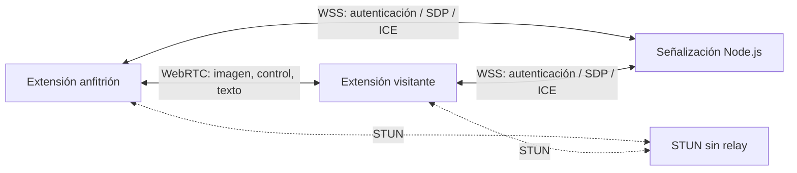

# Arquitectura

## Procesos

El service worker de la extensión mantiene la autorización de ventana, aplica comandos CDP permitidos y ejecuta operaciones de `chrome.tabs`. La página offscreen mantiene WebSocket, RTCPeerConnection y el adaptador de portapapeles. El popup contiene la activación consciente; el viewer muestra la imagen y traduce las interacciones. No hay content scripts accesibles a las páginas ni un servidor de depuración escuchando en el PC.

## Identidad y sesión

`POST /v1/devices` crea un identificador público aleatorio de 128 bits y devuelve una credencial de propietario de 256 bits una sola vez. SQLite conserva el hash SHA-256 de esa credencial. La extensión la guarda en `storage.local` limitado a `TRUSTED_CONTEXTS`; esto no cifra el perfil frente a un usuario con acceso al disco.

`/v1/connect` recibe mensajes WSS definidos por `packages/protocol`: `host.open`, `guest.join`, `signal`, `host.close` y `ping`. El servidor emite `host.ready`, `paired`, `signal`, `ended`, `error` y `pong`. La contraseña humana se verifica con scrypt asíncrono, sal aleatoria y concurrencia limitada. No se guarda en SQLite. Conocer el identificador público no concede el rol de anfitrión.

Las salas pertenecen al socket autenticado. Cada apertura obtiene un sessionId nuevo; todos los intercambios de señalización se validan contra la sesión y el rol del socket. Tras una operación criptográfica asíncrona se comprueba de nuevo la vigencia de la sala. Un segundo visitante no desplaza al primero.

El servidor es parte de la confianza del emparejamiento. TLS protege contraseñas y señalización en tránsito; WebRTC protege el transporte directo. No hay PAKE ni garantía frente a un servidor de señalización malicioso.

## Transporte y permisos

El canal de imagen transporta JPEG fragmentado con metadatos de pestaña, geometría y generación. La reconstrucción tiene límites de tamaño, caducidad y número de imágenes pendientes. Control y texto usan canales fiables independientes. Los mensajes recibidos se validan; el visitante no puede solicitar métodos CDP arbitrarios.

La captura y la entrada se ligan al mismo target. El control requiere pertenencia a la ventana autorizada, pestaña activa, estado habilitado y generación vigente. Los cambios de pestaña invalidan la imagen anterior. Una imagen estática no constituye por sí sola una desconexión.

Los permisos de portapapeles son opcionales. La sincronización solo se ejecuta si ambos peers la habilitan, parte de un valor inicial que no transmite y deduplica escrituras mediante versión y origen. No almacena historial ni transmite contenido por señalización.

## Límites de confianza

- Un visitante autorizado puede modificar y enviar datos desde las páginas compartidas, conforme al alcance informado al anfitrión.
- Las páginas web no pueden invocar los mensajes internos de la extensión; no se declara `externally_connectable`.
- El token de propietario nunca se entrega al visitante ni se incluye en direcciones o logs.
- Se rechazan candidatos relay y servidores TURN. La conexión puede fallar detrás de redes restrictivas.
- Cancelar o terminar requiere cortar captura, entrada, portapapeles y canales. Una cancelación del navegador no se neutraliza reconectando el debugger automáticamente.
